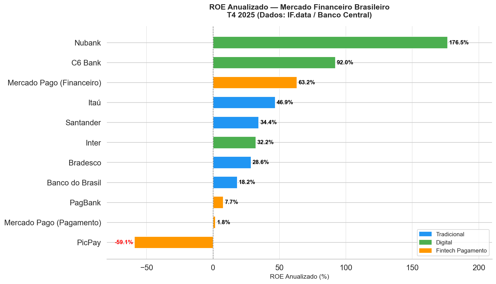

# Panorama Competitivo do Mercado Financeiro Brasileiro

> Análise comparativa entre bancos tradicionais, bancos digitais e fintechs no Brasil — usando dados públicos do Banco Central.

## 🎯 Pergunta de negócio

Os bancos digitais estão de fato conquistando o mercado financeiro brasileiro, ou os bancos tradicionais ainda mantêm vantagem competitiva sustentável em rentabilidade, escala e eficiência?

---

## 📊 Principais Insights

**1. Em eficiência de capital, o Nubank já deixou os bancões para trás**
Nubank tem ROE médio de 120,7% vs 31,2% do Itaú — 3,7x mais rentável sobre o patrimônio. O modelo digital, sem agências físicas e com infraestrutura enxuta, gera lucro com base patrimonial muito menor.

**2. Crescimento assimétrico: digitais dobram, tradicionais estabilizam**
Em 2 anos, Nubank cresceu +98% e C6 Bank +93% em ativos. Itaú cresceu apenas +8,4%. Santander e Itaú chegaram a encolher no comparativo anual (T4 2024 vs T4 2025).

**3. Fintechs de pagamento ainda buscam rentabilidade estrutural**
PicPay opera com ROE médio negativo (-11,6%). Mercado Pago cresce +140% em ativos mas com alta volatilidade de rentabilidade. O modelo de pagamentos ainda não encontrou escala lucrativa consistente.

---

## 🏦 Instituições analisadas

| Categoria | Bancos |
|---|---|
| Tradicionais | Itaú, Bradesco, Banco do Brasil, Santander |
| Digitais | Nubank, C6 Bank, Inter |
| Fintechs de Pagamento | PagBank, Mercado Pago, PicPay |

---

## 📈 KPIs avaliados

- **ROE** (Return on Equity) anualizado
- **Crescimento de Ativo Total** (série histórica 8 trimestres)
- **Lucro Líquido** e Patrimônio Líquido
- **Carteira de Crédito** (disponível para 2025)
- **Captações** e Número de Agências

---

## 🛠️ Stack e ferramentas

| Etapa | Ferramenta |
|---|---|
| Coleta | IF.data / Banco Central do Brasil |
| Tratamento e ETL | Python 3.x + pandas 2.3.3 |
| Análise SQL | DuckDB |
| Visualização | Matplotlib + Seaborn + Power BI |
| Versionamento | Git / GitHub |

---

## 📁 Estrutura do projeto
01_dados_brutos/         # 8 CSVs do IF.data (2024T1–2025T4)
02_dados_tratados/       # base_consolidada.csv com ROE calculado
03_sql/                  # Queries SQL analíticas com DuckDB
04_analise_python/       # Notebooks Jupyter (ETL + análise visual)
05_dashboard_powerbi/    # Dashboard .pbix + screenshots
06_relatorio_executivo/  # Relatório executivo Word + gráficos
docs/                    # Metodologia e fontes de dados

---

## 🔗 Links

- 📄 [Relatório Executivo](06_relatorio_executivo/relatorio_executivo.docx)
- 💼 [Post no LinkedIn](https://lnkd.in/dTqwEUB5)
- 📓 [Notebook ETL](04_analise_python/01_exploracao_inicial.ipynb)
- 📓 [Notebook Análise Visual](04_analise_python/02_analise_visual.ipynb)
- 📓 [Notebook SQL](04_analise_python/03_analise_sql.ipynb)

---

## 📅 Status

✅ **Projeto concluído** — Maio de 2026

---

## 👤 Autor

**Carlos Armando Munhoz Vilela**
Analista de dados em formação | Foco em mercado financeiro brasileiro

